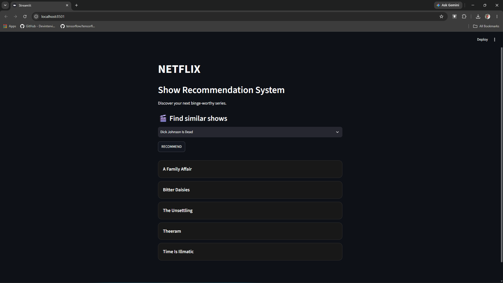
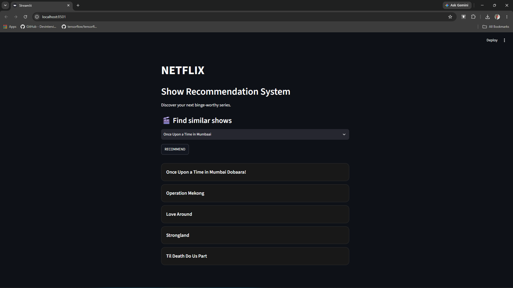

# ****Netflix Shows Recommendation system****

<div align="center">
  
</div>


  Recommendation systems are becoming extensively important in this extremely fast moving world. People are short on time with multitudinous task they need to accompolish in limited time.
  Therefore, recommendation systems are important as they helps them to make right choices, without spending much time on research.
  
  Finding and recommending relevant content that matches the interests of users is the prime objective of a recommendation system. This technique utilizes the use of artificial intelligence through
  which algorithms analyze big data sets, including user information, user searches, and similar user behavior, in order to forecast their future interest in some particular content. Through predictive
  modeling and rules on big data, a list of relevant content is generated for the user.

---
  ## **Types of Recommendation System:**
  
  1. **Content Based:**
  - Recommendations are done by analysing metadata of content to be watched or listened rather than other user's profile.
  - It hypothesize if user was interested in some content, they will once again interested in similar content.
  - One main issue rises that is recommending obious content. for e.g., if user is interested in 3 different categories. system will recommend content in those 3 categories only even though
    other's could be interesting to user.
  - e.g., Streaming apps suggesting movies of the exact same genre, director, or actor.
    
  2. **Collaborative Based:**
  - Predicts user preferences based on historical behevior and other user's behaviour.
  - The core idea is if most users in cluster agreed to content then other also will.
  - e.g., Amazon's "If user bought this then similar user also bout this."

  3. **Hybrid Recommendation System:**
  - Combines collaborative filtering and content-based filtering (and sometimes contextual rules) to leverage the strengths of both and overcome individual limitations.
  - e.g., YouTube blends viewing pattern with detailed metadata.

---
  # ****About This Project****

  ### Demo:
  
<div align="center">
  
  
  
</div>

---
  ## ****Concepts****: 
  ### ****Cosine Similarity****:
  - It is metric thatt allows us to calculate similarity scores between content.
  - In order to demostrate cosine similarity function we need vectors. Here vectors are numpy array.
  - The simiarity score ranges between 0 and 1. The score closer to 1 both content will more similar.
---
  ## ****How to run?****
  ### STEPS:

Clone the repository

```bash
https://github.com/entbappy/Movie-Recommender-System-Using-Machine-Learning.git
```

### STEP 01 - Create environment after opening the repository

```bash
uv venv .movie
```

```bash
# If uv is not installed
python3 -m venv .movie
```

```bash
.movie\Scripts\activate
```
### STEP 02 - Download dataset 
- Download dataset using link in Data folder.
- Paste Dataset in "Data" folder. 

### STEP 03 - install the requirements
```bash
uv pip install -r requirements.txt
```

### STEP 04 - Run Scripts

```bash
# run below scripts one after another 
load_data.py               # Loads dataset in the sqlite3 Database
clean_data.py              # Cleans the dataset and loads into sqlite3 database
```

Now run,
```bash
streamlit run "scripts\show_recommend.py"
```
